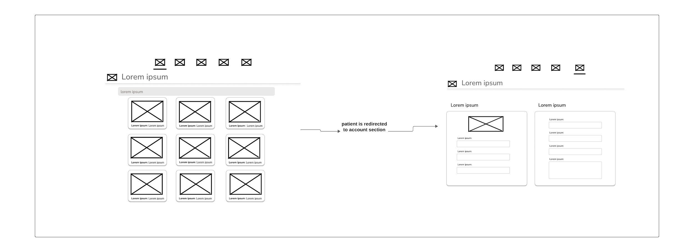
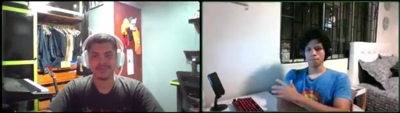
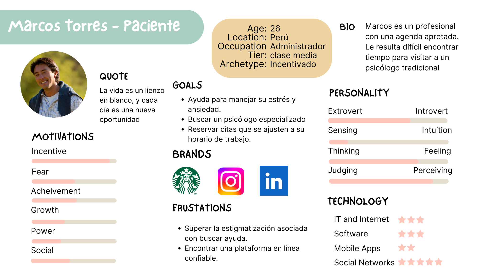

Universidad Peruana de ciencias aplicadas

5to ciclo

Aplicaciones Web

WS51

Juan Antonio Flores Moroco

"Informe de Trabajo Final"

Grupo: Panqueque

Producto: MindCare

Relación de integrantes:

- Barbara Susana Quezada Portalatino

- Jimena Tamara Cama Salvatierra

- Sebastian Nicolas Cachis Gonzales

- Enzo Paolo Noblecilla Jimenez

- Elias Yauri Paucar

Abril 2024

# Registro de versiones del informe

<table>
<colgroup>
<col style="width: 11%" />
<col style="width: 15%" />
<col style="width: 15%" />
<col style="width: 58%" />
</colgroup>
<thead>
<tr class="header">
<th><blockquote>

Versión

</blockquote></th>
<th><blockquote>

Fecha

</blockquote></th>
<th><blockquote>

Autor

</blockquote></th>
<th><blockquote>

Descripción

</blockquote></th>
</tr>
<tr class="odd">
<th rowspan="3"><blockquote>

TB1

</blockquote></th>
<th><blockquote>

28/03/2024

</blockquote></th>
<th><blockquote>

Jimena Cama

</blockquote></th>
<th>Identifiqué e implemente el User persona para el Needfinding, en
base a las entrevistas realizadas. Así como, parte de los User Stories y
el Product Backlog</th>
</tr>
<tr class="header">
<th><blockquote>

31/03/2024

</blockquote></th>
<th><blockquote>

Jimena Cama

</blockquote></th>
<th>Diseñé el General Style Guideline para la Web Application. Además,
de el Web Style Guideline. Mismamente, identifiqué el proceso del
usuario dentro de nuestra Web Application en el Organization
System.</th>
</tr>
<tr class="odd">
<th><blockquote>

05/04/2024

</blockquote></th>
<th><blockquote>

Jimena Cama

</blockquote></th>
<th>En Product Design, actualicé el header y la sección de
Contactáctanos.</th>
</tr>
</thead>
<tbody>
</tbody>
</table>

# Student Outcome

<table>
<colgroup>
<col style="width: 33%" />
<col style="width: 33%" />
<col style="width: 33%" />
</colgroup>
<thead>
<tr class="header">
<th><strong>Criterio específico</strong></th>
<th><strong>Acciones realizadas</strong></th>
<th><strong>Conclusiones</strong></th>
</tr>
<tr class="odd">
<th>Comunica oralmente sus ideas y/o resultados con objetividad a
público de diferentes especialidades y niveles jerarquicos, en el marco
del desarrollo de un proyecto en ingeniería.</th>
<th>
-Jimena Tamara Cama Salvatierra TB1, para esta entrega
identifiqué el problema que solucionaremos, el principal segmento
objetivo en el que nos enfocaremos. Así mismo, planteé algunas
hipótesis, riesgos y soluciones respecto al desarrollo de esta. Tomé
decisiones de diseño para la landing page.

-Enzo Paolo Noblecilla Jimenez TB1, para esta entrega identifique las
hipótesis de nuestro proyecto, así mismo plantie varias cuestiones que
se presentan al momento de crear nuestro proyecto
</th>
<th></th>
</tr>
<tr class="header">
<th>Comunica en forma escrita ideas y/o resultados con objetividad a
público de diferentes especialidades y niveles jerárquicos, en el marco
del desarrollo de un proyecto en ingeniería..</th>
<th>
-Jimena Tamara Cama Salvatierra TB1, al identificar distintos
aspectos base de nuestra start up tomé en cuenta las necesidades y
limitaciones de los psicólogos y los pacientes, tanto para el lean ux
canva como para la interfaz de la landing page.

-Enzo Paolo Noblecilla Jimenez TB1, al crear el empathy map tome en
cuenta las opiniones del paciente y psicólogo planteando sus
pensamientos y opiniones
</th>
<th></th>
</tr>
</thead>
<tbody>
</tbody>
</table>

#Índice
# Capítulo I: Introducción
## 1.1. Startup Profile
### 1.1.1. Descripción de la Startup
### 1.1.2. Perfiles de integrantes del equipo
## 1.2. Solution Profile
### 1.2.1 Antecedentes y problemática
### 1.2.2 Lean UX Process.
#### 1.2.2.1. Lean UX Problem Statements.
#### 1.2.2.2. Lean UX Assumptions.
#### 1.2.2.3. Lean UX Hypothesis Statements.
#### 1.2.2.4. Lean UX Canvas.
##1.3. Segmentos objetivo.

#Capítulo II: Requirements Elicitation & Analysis.
## 2.1. Competidores.
### 2.1.1. Análisis competitivo.
### 2.1.2. Estrategias y tácticas frente a competidores.
## 2.2. Entrevistas.
### 2.2.1. Diseño de entrevistas.
### 2.2.2. Registro de entrevistas.
### 2.2.3. Análisis de entrevistas.
## 2.3. Needfinding.
### 2.3.1. User Personas
### 2.3.2. User Task Matrix.
### 2.3.3. User Journey Mapping
### 2.3.4. Empathy Mapping
### 2.3.5. As-is Scenario Mapping
## 2.4. Ubiquitous Language (Barbs)

# Capítulo III: Requirements Specification.
## 3.1. To-Be Scenario Mapping.
## 3.2. User Stories.
## 3.3. Impact Mapping.
## 3.4. Product Backlog.

# Capítulo IV: Product Design.
## 4.1. Style Guidelines.
### 4.1.1. General Style Guidelines.
### 4.1.2. Web Style Guidelines
## 4.2. Information Architecture.
### 4.2.1. Organization Systems.
### 4.2.2. Labeling Systems.
### 4.2.3. SEO Tags and Meta Tags
### 4.2.4. Searching Systems.
### 4.2.5. Navigation Systems.
## 4.3. Landing Page UI Design.
### 4.3.1. Landing Page Wireframe
### 4.3.2. Landing Page Mock-up
## 4.4. Web Applications UX/UI Design
### 4.4.1. Web Applications Wireframes
### 4.4.2. Web Applications Wireflow Diagrams Diagrams.
### 4.4.2. Web Applications Mock-ups.
### 4.4.3. Web Applications User Flow Diagrams.
## 4.5. Web Applications Prototyping.
## 4.6. Domain-Driven Software Architecture
### 4.6.1. Software Architecture Context Diagram
### 4.6.2. Software Architecture Container Diagrams
### 4.6.3. Software Architecture Components Diagrams
## 4.7. Software Object-Oriented Design
### 4.7.1. Class Diagrams.
### 4.7.2. Class Dictionary.
## 4.8. Database Design.
### 4.8.1. Database Diagram.

#Capítulo V: Product Implementation, Validation & Deployment.

## 5.1. Software Configuration Management.
### 5.1.1. Software Development Environment Configuration.
### 5.1.2. Source Code Management.
### 5.1.3. Source Code Style Guide & Conventions.
### 5.1.4. Software Deployment Configuration.
### 5.2. Landing Page, Services & Applications Implementation.
### 5.2.1. Sprint 1
#### 5.2.1.1. Sprint Planning 1.
#### 5.2.1.2. Sprint Backlog 1.
#### 5.2.1.3. Development Evidence for Sprint Review
#### 5.2.1.4. Testing Suite Evidence for Sprint Review
#### 5.2.1.5. Execution Evidence for Sprint Review
#### 5.2.1.6. Services Documentation Evidence for Sprint Review
#### 5.2.1.7. Software Deployment Evidence for Sprint Review
#### 5.2.1.8. Team Collaboration Insights during Spring

#Contenido

# Capítulo I: Introducción
## 1.1. Startup Profile
### 1.1.1. Descripción de la Startup
### 1.1.2. Perfiles de integrantes del equipo

• Jimena Tamara Cama Salvatierra

Soy estudiante de la carrera de Ingeniería de Software en la UPC y
actualmente estoy cursando el 5to ciclo. Me considero una persona
curiosa, determinada y organizada. Con la experiencia en proyectos de
startup y trabajos en equipo, trabajaré junto a mis compañeros para
lograr un óptimo resultado del proyecto.

## 1.2. Solution Profile
### 1.2.1 Antecedentes y problemática
### 1.2.2 Lean UX Process.
#### 1.2.2.1. Lean UX Problem Statements.
#### 1.2.2.2. Lean UX Assumptions.
#### 1.2.2.3. Lean UX Hypothesis Statements.
#### 1.2.2.4. Lean UX Canvas.

##1.3. Segmentos objetivo.

#Capítulo II: Requirements Elicitation & Analysis.
## 2.1. Competidores.
### 2.1.1. Análisis competitivo.
### 2.1.2. Estrategias y tácticas frente a competidores.
## 2.2. Entrevistas.
### 2.2.1. Diseño de entrevistas.

Psicólogos:

- ¿Cuáles son los retos más grandes que enfrentan como profesionales de
  la salud mental al trabajar con pacientes?

- ¿Qué herramientas o trucos usan para manejar sus horarios y conectarse
  mejor con sus pacientes?

- ¿Qué cosas son imprescindibles al elegir una plataforma para brindar
  servicios, como la seguridad, la facilidad de uso o la integración con
  otras herramientas?

- ¿Cómo ven ustedes el papel de la tecnología en su día a día

- ¿Cómo creen que podría mejorar la atención a los pacientes?

- ¿Cómo combaten el estigma asociado a buscar ayuda para problemas de
  salud mental en su práctica clínica?

- ¿Qué funciones son cruciales en una plataforma digital para garantizar
  la confidencialidad y privacidad de los pacientes?

- ¿Qué hacen para mantenerse al día con las últimas investigaciones y
  prácticas en el campo de la salud mental?

- ¿Cómo saben si una sesión de terapia o asesoramiento fue efectiva y
  qué métodos usan para seguir el progreso de los pacientes?

- ¿Qué sugerencias tienen para hacer que los servicios de salud mental a
  través de plataformas digitales sean más accesibles y de mejor
  calidad?

Pacientes:

- ¿Cuáles son los mayores desafíos que enfrentas al buscar ayuda para
  tus problemas de salud mental?

- ¿Qué cosas consideras más importantes al elegir un terapeuta o
  consejero para recibir tratamiento o apoyo?

- ¿Qué te impulsa a buscar apoyo en línea para tus problemas emocionales
  en lugar de buscar ayuda de manera tradicional?

- ¿Cuáles son tus principales preocupaciones o obstáculos al intentar
  acceder a servicios de salud mental en tu área?

- ¿Cómo crees que podrían abordarse estos obstáculos?

- ¿Cómo describirías tu experiencia ideal al reservar y participar en
  sesiones de terapia o asesoramiento en línea?

- ¿Qué cualidades valoras más en una plataforma digital de salud mental,
  como la facilidad de uso, la confidencialidad o la variedad de
  profesionales disponibles?

- ¿Cómo han sido tus experiencias previas buscando ayuda con respecto al
  bienestar de tu salud mental?

- ¿Qué tipo de apoyo adicional esperas recibir de una plataforma de
  salud mental en línea más allá de las sesiones de terapia o
  asesoramiento individual?

- ¿Estarías dispuesto a invertir mensualmente en una plataforma de salud
  mental en línea que te brinde acceso para gestionar tu bienestar
  emocional?¿Por qué?

### 2.2.2. Registro de entrevistas.
Sexo: Masculino

Edad: 27 años

Ubicación: Magdalena

Link:
[<u>Fabian_Lujan_Entrevista</u>](https://drive.google.com/file/d/1EZDtghFixeNYTTxErvgZ4lRc7WjbvLZe/view?usp=drive_link)

Duración: 9:47

Resumen:

El psicólogo Fabián comentó que uno de los desafíos más frecuentes a los
que se enfrenta es al estigma asociado a buscar ayuda. Ahora, la manera
en la que trabaja, generalmente utiliza herramientas digitales para
gestionar horarios y conectarse con los pacientes. Prioriza la seguridad
y confiabilidad al elegir plataformas de servicio. La tecnología es
fundamental en su práctica diaria, desde tomar notas hasta grabar
sesiones. Él intenta promover la normalización de la asistencia
psicológica a través de publicaciones en línea. Así mismo, garantiza la
confidencialidad de los pacientes y se mantiene actualizado con
investigaciones y prácticas. De igual manera, evalúa la efectividad de
las sesiones mediante comentarios y referencias de pacientes. Una idea
que ofreció fue mejorar la calidad de los servicios digitales,
enfocándonos en la privacidad, el anonimato y métodos de pago
transparentes.

### 2.2.3. Análisis de entrevistas.

Respecto a las entrevistas registradas, realizamos un análisis de estas,
donde daremos a conocer los hallazgos que obtuvimos gracias a los
psicólogos y a los pacientes.

**En el segmento Psicólogos:**

- Integración de tecnología en la práctica de los psicólogos.

Hallazgos:

- Promoción de la normalización de la asistencia psicológica mediante
  publicaciones en redes.

- Preocupación por la privacidad y la protección de los datos de los
  pacientes en el entorno digital.

**En el segmento Pacientes:**

- Buscar psicólogos o especialista de calidad para la mayor satisfacción
  del paciente

- 

Hallazgos:

- La accesibilidad inmediata y la conveniencia de recibir terapia sin
  desplazamientos físicos son factores significativos que impulsan a los
  individuos a buscar apoyo en línea.

- La habilidad de encontrar terapeutas que no solo posean una
  especialización relevante sino que también generen una conexión
  genuina y empática con el paciente es crucial.

## 2.3. Needfinding.
### 2.3.1. User Personas

**Segmento Psicólogos:**

**Segmento Pacientes:**

### 2.3.2. User Task Matrix.
### 2.3.3. User Journey Mapping
### 2.3.4. Empathy Mapping
### 2.3.5. As-is Scenario Mapping
## 2.4. Ubiquitous Language (Barbs)

# Capítulo III: Requirements Specification.
## 3.1. To-Be Scenario Mapping.
## 3.2. User Stories.
## 3.3. Impact Mapping.
## 3.4. Product Backlog.

# Capítulo IV: Product Design.
## 4.1. Style Guidelines.
### 4.1.1. General Style Guidelines.
### 4.1.2. Web Style Guidelines
## 4.2. Information Architecture.
### 4.2.1. Organization Systems.
### 4.2.2. Labeling Systems.
### 4.2.3. SEO Tags and Meta Tags
### 4.2.4. Searching Systems.
### 4.2.5. Navigation Systems.
## 4.3. Landing Page UI Design.
### 4.3.1. Landing Page Wireframe
### 4.3.2. Landing Page Mock-up
## 4.4. Web Applications UX/UI Design
### 4.4.1. Web Applications Wireframes
### 4.4.2. Web Applications Wireflow Diagrams Diagrams.
### 4.4.2. Web Applications Mock-ups.
### 4.4.3. Web Applications User Flow Diagrams.
## 4.5. Web Applications Prototyping.
## 4.6. Domain-Driven Software Architecture
### 4.6.1. Software Architecture Context Diagram
### 4.6.2. Software Architecture Container Diagrams
### 4.6.3. Software Architecture Components Diagrams
## 4.7. Software Object-Oriented Design
### 4.7.1. Class Diagrams.
### 4.7.2. Class Dictionary.
## 4.8. Database Design.
### 4.8.1. Database Diagram.

#Capítulo V: Product Implementation, Validation & Deployment.

## 5.1. Software Configuration Management.
### 5.1.1. Software Development Environment Configuration.
### 5.1.2. Source Code Management.
### 5.1.3. Source Code Style Guide & Conventions.
### 5.1.4. Software Deployment Configuration.
### 5.2. Landing Page, Services & Applications Implementation.
### 5.2.1. Sprint 1
#### 5.2.1.1. Sprint Planning 1.
#### 5.2.1.2. Sprint Backlog 1.
#### 5.2.1.3. Development Evidence for Sprint Review
#### 5.2.1.4. Testing Suite Evidence for Sprint Review
#### 5.2.1.5. Execution Evidence for Sprint Review
#### 5.2.1.6. Services Documentation Evidence for Sprint Review
#### 5.2.1.7. Software Deployment Evidence for Sprint Review
#### 5.2.1.8. Team Collaboration Insights during Spring
